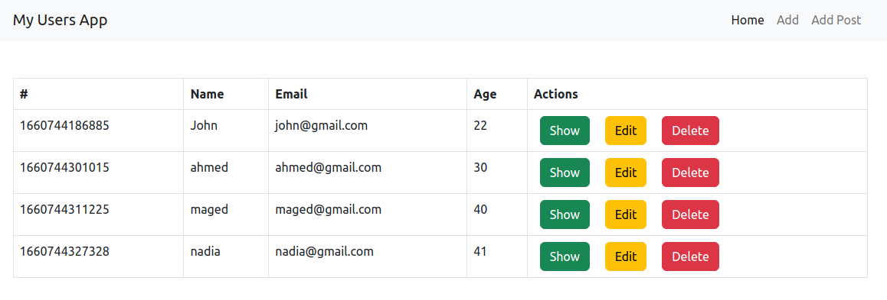

## Creating a CRUD api using express and handlebars

### Requirements

(First make sure you're in the `expressApp` directory)
```
npm init --y
npm i express hbs
```

### To run the app

(install `nodemon` globbally if you don't have it to run the application with it)
> ```npm i -g nodemon```

```
nodemon index
```

The api should look like this 
- you can add, edit, delete and show every single user

  
